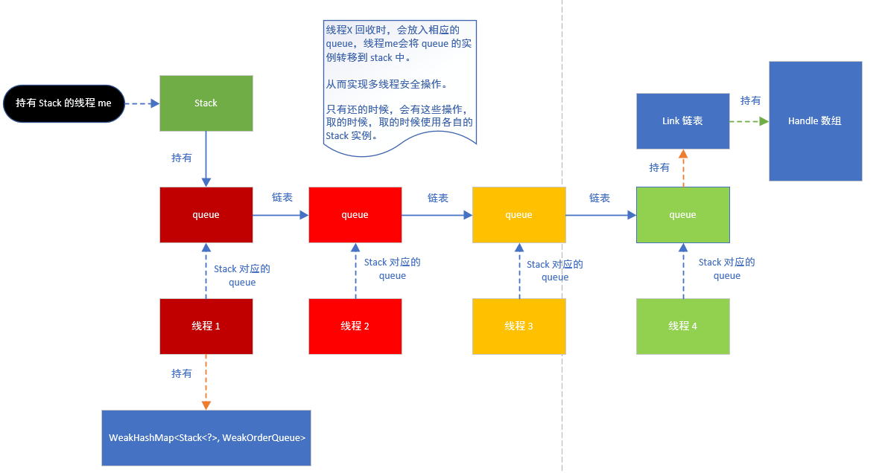

# Recycler解析




## 主要方法介绍

> Light-weight object pool based on a thread-local stack.
> 基于线程局部堆栈的轻量级对象池。

该类是个容器，内部主要是一个 Stack 结构。当需要使用一个实例时，就弹出，当使用完毕时，就清空后入栈。

<!--more-->

- 该类有 2 个主要方法：

```java
public final T get() // 从 threadLocal 中取出 Stack 中首个 T 实例。
protected abstract T newObject(Handle<T> handle) // 当 Stack 中没有实例的时候，创建一个实例返回。
```

- 该类有 4 个内部接口 / 内部类：

```java
  // 定义 handler 回收实例
  public interface Handle<T> {
      void recycle(T object);
  }
  
  // Handle 的默认实现，可以将实例回收，放入 stack。
  static final class DefaultHandle<T> implements Handle<T>
  
  // 存储对象的数据结构。对象池的真正的 “池”
  static final class Stack<T>
  
  // 多线程共享的队列
  private static final class WeakOrderQueue
  
  // 队列中的链表结构，用于存储多线程回收的实例
  private static final class Link extends AtomicInteger
```

- 实现线程局部缓存的 FastThreadLocal：

```java
  private final FastThreadLocal<Stack<T>> threadLocal = new FastThreadLocal<Stack<T>>() {
      @Override
      protected Stack<T> initialValue() {
          return new Stack<T>(Recycler.this, Thread.currentThread(), maxCapacityPerThread, maxSharedCapacityFactor,
                  ratioMask, maxDelayedQueuesPerThread);
      }
  
      @Override
      protected void onRemoval(Stack<T> value) {
          if (value.threadRef.get() == Thread.currentThread()) {
             if (DELAYED_RECYCLED.isSet()) {
                 DELAYED_RECYCLED.get().remove(value);
             }
          }
      }
  };
```

- 核心方法 get 操作

```java
public final T get() {
    if (maxCapacityPerThread == 0) {
        return newObject((Handle<T>) NOOP_HANDLE);
    }
    Stack<T> stack = threadLocal.get();
    DefaultHandle<T> handle = stack.pop();
    if (handle == null) {
        handle = stack.newHandle();
        handle.value = newObject(handle);
    }
    return (T) handle.value;
}
```

- 核心方法 DefaultHandle 的 recycle 操作

```java
  public void recycle(Object object) {
      if (object != value) {
          throw new IllegalArgumentException("object does not belong to handle");
      }
      stack.push(this);
  }
```

## 使用范例

```java
// 实现了 Recycler 抽象类
private static final Recycler<Entry> RECYCLER = new Recycler<Entry>() {
    protected Entry newObject(Handle<Entry> handle) {
        return new Entry(handle);
    }
};

// 创建实例
Entry entry = RECYCLER.get();
// doSomeing......
// 归还实例
handle.recycle(entry);
```

调用get()的时候从threadLocal 取出 Stack再取出复用的对象或者新建

当使用完之后调用recycle()把对象放回Stack供下次使用

## Stack解析

#### pop方法

```java
DefaultHandle<T> pop() {
  int size = this.size;
  if (size == 0) {
    // 元素为空，从其他队列里面获取元素放到栈里面
    if (!scavenge()) {
      return null;
    }
    size = this.size;
    if (size <= 0) {
      // double check, avoid races
      return null;
    }
  }
  // 递减取出元素
  size --;
  DefaultHandle ret = elements[size];
  elements[size] = null;
  // As we already set the element[size] to null we also need to store the updated size before we do
  // any validation. Otherwise we may see a null value when later try to pop again without a new element
  // added before.
  this.size = size;

  if (ret.lastRecycledId != ret.recycleId) {
    throw new IllegalStateException("recycled multiple times");
  }
  ret.recycleId = 0;
  ret.lastRecycledId = 0;
  // 返回元素
  return ret;
}
```

#### push方法

```java
void push(DefaultHandle<?> item) {
  Thread currentThread = Thread.currentThread();
  if (threadRef.get() == currentThread) {
    // The current Thread is the thread that belongs to the Stack, we can try to push the object now.
    // 如果是当前线程和当前Stack的线程所有者一样，不存在多线程操作，直接操作数组放入元素
    pushNow(item);
  } else {
    // The current Thread is not the one that belongs to the Stack
    // (or the Thread that belonged to the Stack was collected already), we need to signal that the push
    // happens later.
    // 不是同一个线程，存在并发操作，将元素放到该线程对应的WeakOrderQueue队列，解决并发问题
    pushLater(item, currentThread);
  }
}

private void pushLater(DefaultHandle<?> item, Thread thread) {
    // 每个 Stack 对应一串 queue，找到当前线程的 map
    Map<Stack<?>, WeakOrderQueue> delayedRecycled = DELAYED_RECYCLED.get();
    // 查看当前线程中是否含有这个 Stack 对应的队列
    WeakOrderQueue queue = delayedRecycled.get(this);
    if (queue == null) {// 如果没有
        // 如果 map 长度已经大于最大延迟数了，则向 map 中添加一个假的队列
        if (delayedRecycled.size() >= maxDelayedQueues) {// 8
            delayedRecycled.put(this, WeakOrderQueue.DUMMY);
            return;
        }
        // 如果长度不大于最大延迟数，则尝试创建一个queue，链接到这个 Stack 的 head 节点前（内部创建Link）
        if ((queue = WeakOrderQueue.allocate(this, thread)) == null) {
            // drop object
            return;
        }
        delayedRecycled.put(this, queue);
    } else if (queue == WeakOrderQueue.DUMMY) {
        // drop object
        return;
    }

    queue.add(item);
}
```

#### scavenge 方法

```java
boolean scavenge() {
    // continue an existing scavenge, if any
    // 清理成功后，stack 的 size 会变化
    if (scavengeSome()) {
        return true;
    }

    // reset our scavenge cursor
    prev = null;
    cursor = head;
    return false;
}

boolean scavengeSome() {
    WeakOrderQueue prev;
    WeakOrderQueue cursor = this.cursor;
    if (cursor == null) {
        prev = null;
        cursor = head;
        if (cursor == null) {
            return false;
        }
    } else {
        prev = this.prev;
    }
    boolean success = false;
    do {
        // 将 head queue 的实例转移到 this stack 中
        if (cursor.transfer(this)) {
            success = true;
            break;
        }
        // 如果上面失败，找下一个节点
        WeakOrderQueue next = cursor.next;
        // 如果当前线程被回收了，
        if (cursor.owner.get() == null) {
          // 只要最后一个节点还有数据，就一直转移
            if (cursor.hasFinalData()) {
                for (;;) {
                    if (cursor.transfer(this)) {
                        success = true;
                    } else {
                        break;
                    }
                }
            }
            if (prev != null) {
                prev.setNext(next);
            }
        } else {
            prev = cursor;
        }
        cursor = next;
    } while (cursor != null && !success);
    // 转移成功之后，将 cursor 重置
    this.prev = prev;
    this.cursor = cursor;
    return success;
}
```

## 总结

Netty 并没有使用第三方库实现对象池，而是自己实现了一个相对轻量的对象池。通过使用 threadLocal，避免了多线程下取数据时可能出现的线程安全问题，同时，为了实现多线程回收同一个实例，让每个线程对应一个队列，队列链接在 Stack 对象上形成链表，这样，就解决了多线程回收时的安全问题。同时，使用了软引用的map 和 软引用的 thradl 也避免了内存泄漏。