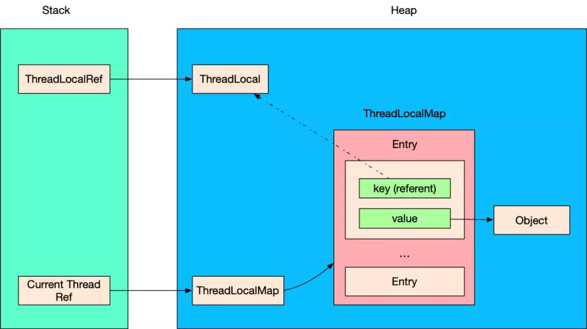

ThreadLocal内部类ThreadLocalMap是存取数据的主要实现

存储的结构如下

Thread->ThreadLocalMap->Entry[]->Entry(WeakReference(ThreadLocal), value)

ThreadLocalMap 的内部结构其实跟 HashMap 很类似

二者都是「键-值对」构成的数组，对哈希冲突的处理方式不同，导致了它们在结构上产生了一些区别：

1. HashMap 处理哈希冲突使用的「链表法」。也就是当产生冲突时拉出一个链表，而且 JDK 1.8 进一步引入了红黑树进行优化。
2. ThreadLocalMap 则使用了「开放寻址法」中的「线性探测」。即，当某个位置出现冲突时，从当前位置往后查找，直到找到一个空闲位置。

其它部分大体是类似的。

#### set方法

```java
//ThreadLocal
public void set(T value) {
    // 获取当前线程
    Thread t = Thread.currentThread();
    // 从 Thread 中获取 ThreadLocalMap
    ThreadLocalMap map = getMap(t);

    if (map != null)
        map.set(this, value);
    else
        createMap(t, value);
}
//ThreadLocal
ThreadLocalMap getMap(Thread t) {
    return t.threadLocals;
}

//ThreadLocalMap
private void set(ThreadLocal<?> key, Object value) {    
    Entry[] tab = table;
    int len = tab.length;
    // 1. 计算 key 在数组中的下标 i
    int i = key.threadLocalHashCode & (len-1);
    
    // 1.1 若数组下标为 i 的位置有元素
    // 判断 i 位置的 Entry 是否为空；不为空则从 i 开始向后遍历数组
    for (Entry e = tab[i];
         e != null;
         e = tab[i = nextIndex(i, len)]) {
        ThreadLocal<?> k = e.get();
        
        // 索引为 i 的元素就是要查找的元素，用新值覆盖旧值，到此返回
        if (k == key) {
            e.value = value;
            return;
        }
        
        // 索引为 i 的元素并非要查找的元素，且该位置中 Entry 的 Key 已经是 null
        // Key 为 null 表明该 Entry 已经过期了，此时用新值来替换这个位置的过期值
        if (k == null) {
            // 替换过期的 Entry，
            replaceStaleEntry(key, value, i);
            return;
        }
    }
    
    // 1.2 若数组下标为 i 的位置为空，将要存储的元素放到 i 的位置
    tab[i] = new Entry(key, value);
    int sz = ++size;
    // 若未清理过期的 Entry，且数组的大小达到阈值，执行 rehash 操作
    if (!cleanSomeSlots(i, sz) && sz >= threshold)
        rehash();
}

// 替换过期的值，并清理一些过期的 Entry
private void replaceStaleEntry(ThreadLocal<?> key, Object value,
                               int staleSlot) {
    Entry[] tab = table;
    int len = tab.length;
    Entry e;
    
    // 从 staleSlot 开始向前遍历，若遇到过期的槽（Entry 的 key 为空），更新 slotToExpunge
    // 直到 Entry 为空停止遍历
    int slotToExpunge = staleSlot;
    for (int i = prevIndex(staleSlot, len);
         (e = tab[i]) != null;
         i = prevIndex(i, len))
        if (e.get() == null)
            slotToExpunge = i;
    
    // 从 staleSlot 开始向后遍历，若遇到与当前 key 相等的 Entry，更新旧值，并将二者换位置
    // 目的是把它放到「应该」在的位置
    for (int i = nextIndex(staleSlot, len);
         (e = tab[i]) != null;
         i = nextIndex(i, len)) {
        ThreadLocal<?> k = e.get();
        
        if (k == key) {
            // 更新旧值
            e.value = value;
            
            // 换位置
            tab[i] = tab[staleSlot];
            tab[staleSlot] = e;
            
            // Start expunge at preceding stale entry if it exists
            if (slotToExpunge == staleSlot)
                slotToExpunge = i;
            cleanSomeSlots(expungeStaleEntry(slotToExpunge), len);
            return;
        }
        
        if (k == null && slotToExpunge == staleSlot)
            slotToExpunge = i;
    }
    
    // If key not found, put new entry in stale slot
    // 若未找到 key，说明 Entry 此前并不存在，新增
    tab[staleSlot].value = null;
    tab[staleSlot] = new Entry(key, value);
    
    // If there are any other stale entries in run, expunge them
    if (slotToExpunge != staleSlot)
        cleanSomeSlots(expungeStaleEntry(slotToExpunge), len);
}


// 清理过期的Entry，也就是弱引用ThreadLocal key 被回收了 等于null的 Entry，Value的强引用也会被设置null
// staleSlot 表示过期的槽位（即 Entry 数组的下标）
private int expungeStaleEntry(int staleSlot) {
    Entry[] tab = table;
    int len = tab.length;
    
    // 1. 将给定位置的 Entry 置为 null
    tab[staleSlot].value = null;
    tab[staleSlot] = null;
    size--;
    
    // Rehash until we encounter null
    Entry e;
    int i;
    // 遍历数组
    for (i = nextIndex(staleSlot, len);
         (e = tab[i]) != null;
         i = nextIndex(i, len)) {
        // 获取 Entry 的 key
        ThreadLocal<?> k = e.get();
        if (k == null) {
            // 若 key 为 null，表示 Entry 过期，将 Entry 置空
            e.value = null;
            tab[i] = null;
            size--;
        } else {
            // key 不为空，表示 Entry 未过期
            // 计算 key 的位置，若 Entry 不在它「应该」在的位置，把它移到「应该」在的位置
            int h = k.threadLocalHashCode & (len - 1);
            if (h != i) {
                tab[i] = null;
                // Unlike Knuth 6.4 Algorithm R, we must scan until
                // null because multiple entries could have been stale.
                while (tab[h] != null)
                    h = nextIndex(h, len);
                tab[h] = e;
            }
        }
    }
    return i;
}

//清理一些槽
private boolean cleanSomeSlots(int i, int n) {
    boolean removed = false;
    Entry[] tab = table;
    int len = tab.length;
    do {
        i = nextIndex(i, len);
        Entry e = tab[i];
        // Entry 不为空、key 为空，即 Entry 过期
        if (e != null && e.get() == null) {
            n = len;
            removed = true;
            // 清理 i 后面连续过期的 Entry，直到 Entry 为 null，返回该 Entry 的下标
            i = expungeStaleEntry(i);
        }
    } while ( (n >>>= 1) != 0);
    return removed;
}
```

#### get方法

```java
private Entry getEntry(ThreadLocal<?> key) {
    // 计算下标
    int i = key.threadLocalHashCode & (table.length - 1);
    Entry e = table[i];
    // 查找命中
    if (e != null && e.get() == key)
        return e;
    else
        return getEntryAfterMiss(key, i, e);
}

// key 未命中
private Entry getEntryAfterMiss(ThreadLocal<?> key, int i, Entry e) {
    Entry[] tab = table;
    int len = tab.length;
    
    // 遍历数组
    while (e != null) {
        ThreadLocal<?> k = e.get();
        if (k == key)
            return e; // 是要找的 key，返回
        if (k == null)
            expungeStaleEntry(i); // Entry 已过期，清理 Entry
        else
            i = nextIndex(i, len); // 向后遍历
        e = tab[i];
    }
    return null;
}
```

## 总结

首先说明一点，ThreadLocal 通常作为成员变量或静态变量来使用（也就是共享的），比如前面应用场景中的例子。因为局部变量已经在同一条线程内部了，没必要使用 ThreadLocal。

为便于理解，这里先给出了 Thread、ThreadLocal、ThreadLocalMap、Entry 这几个类在 JVM 的内存示意图：



简单说明：

- 当一个线程运行时，栈中存在当前 Thread 的栈帧，它持有 ThreadLocalMap 的强引用。
- ThreadLocal 所在的类持有一个 ThreadLocal 的强引用；同时，ThreadLocalMap 中的 Entry 持有一个 ThreadLocal 的弱引用。